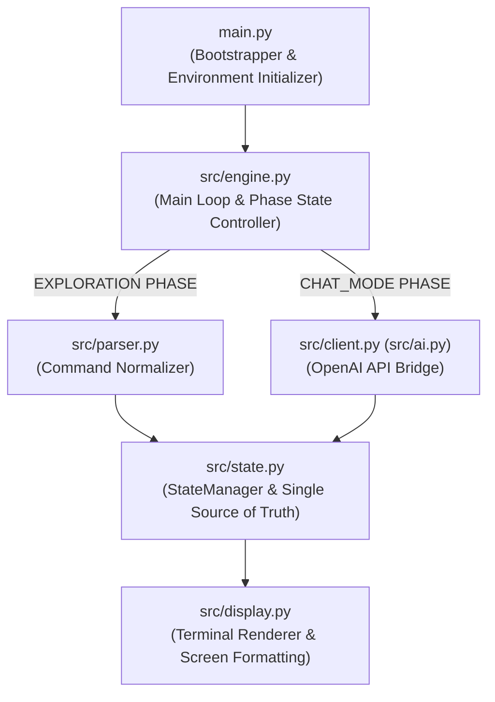
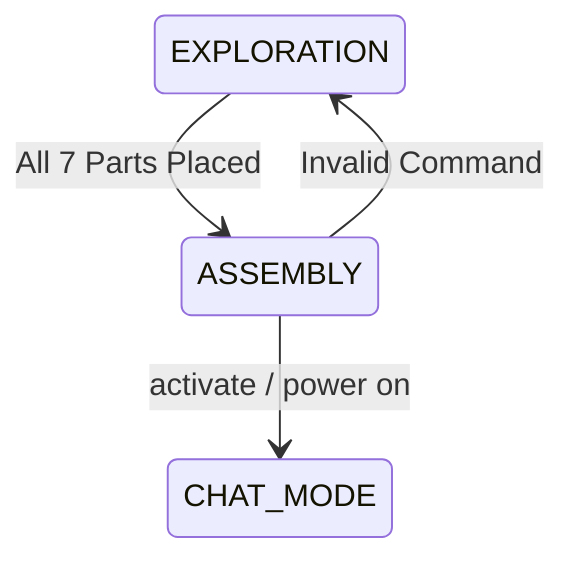

# Architecture & System Design Specification

This document provides a technical overview of the A-maze-ing-Delft engine architecture, module boundaries, data pipelines, state machines, and execution phase transitions.

## Contents

- [System Overview & Core Principles](#system-overview--core-principles)
- [Finite State Machine Architecture](#finite-state-machine-architecture)
- [Detailed Module Specifications](#detailed-module-specifications)
- [Persistence & File Layout](#persistence--file-layout)

## System Overview & Core Principles



## Finite State Machine Architecture

The engine operates on a finite state machine governed by `game_state["game_phase"]`.

```text
[ EXPLORATION ] --(All 7 parts placed)--> [ ASSEMBLY ] --(Player runs 'activate')--> [ CHAT_MODE ]
```

- **EXPLORATION:** input handled by `src/parser.py`.
- **ASSEMBLY:** validation phase, checks workbench.
- **CHAT_MODE:** input routed to `src/client.py`.



### Phase Definitions

1. **EXPLORATION Phase**
   - Parser accepts: `look`, `go`, `inspect`, `take`, `use`.
   - State updates inventory, room objects, and room lock flags.

2. **ASSEMBLY Phase**
   - Triggered when `workbench.is_ready == True`.
   - Player issues `activate` or `power on` command in Lab D 2001.

3. **CHAT_MODE Phase**
   - Command parser is bypassed.
   - User input routes directly to `src/client.py` -> OpenAI ChatGPT API.
   - Response streams directly back to CLI prompt.

## Detailed Module Specifications

### `main.py` — Application Bootstrapper

### `src/state.py` — State Manager & Data Mutations

```text
┌──────────────────────────────────────┐
│          src/state.py                │
├──────────────────────────────────────┤
│ - state: dict                        │
├──────────────────────────────────────┤
│ + load_default_state()               │
│ + move_player(direction) -> bool     │
│ + take_item(item_id) -> bool         │
│ + use_workbench(item_id) -> bool     │
│ + save_game(slot_name) -> None       │
│ + load_game(slot_name) -> bool       │
└──────────────────────────────────────┘
```

### `src/display.py` — UI & CLI Formatting

#### Standard Terminal Header Layout

```text
================================================================================
LOCATION: Lab D 2001                       | INVENTORY: [Blueprint, API USB]
================================================================================
The final assembly lab equipped with an industrial workbench.

Visible Items: None
Exits: [East -> Teacher Room 4]

>
```

## Persistence & File Layout

Directory structure separating template data from player saves:

```text
A-maze-ing-Delft/
├── data/
│   ├── game_state.json     # Master read-only default game state
│   └── system_prompt.txt   # System persona prompt for OpenAI API
└── saves/
    ├── save_slot_1.json    # Active player save file
    └── save_slot_2.json    # Backup save slot
```
