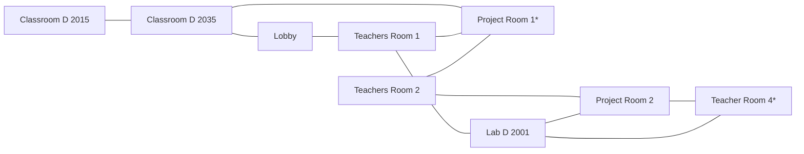
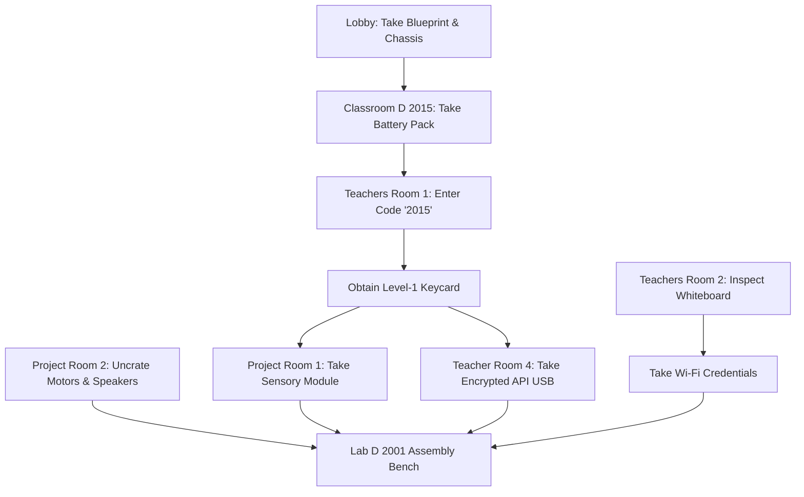

# A-maze-ing-Delft Master Game Design Document (GDD)

This document serves as the canonical game design specification for A-maze-ing-Delft, detailing the narrative framework, room map graph, item matrix, puzzle mechanics, and AI transition specifications.

## 1. Narrative Arc & Three-Act Progression

### Premise

It is 10:45 PM on a Friday. You are locked inside the Computer Science building wing. The exit doors are electronically sealed until campus security arrives at 6:00 AM.

While searching the floor lobby, a terminal flashes an emergency system prompt left by legendary faculty researcher Professor Vance: "A-maze-ing-Delft incomplete. Assemble core physical sub-assemblies across Floor 2 to override facility lockdown."

### Story Progression

| Act I: Search & Acquire       | Act II: Assembly & Hardening    | Act III: Sentience          |
| ----------------------------- | ------------------------------- | --------------------------- |
| Discover blueprint            | Unlock Project & Staff Rooms    | Power on workstation        |
| Locate basic chassis frame    | Gather sensors, power, & motors | Load neural weights via USB |
| Solve desk keypad lock in TR1 | Flash network Wi-Fi credentials | Live ChatGPT conversation   |

## 2. Floor Map & Topology Visual

```text
[Classroom D 2015] ─────── [Classroom D 2035] ─────── [Project Room 1]*
                             │                          │                         │
                             │                          │                         │
                         [Lobby] ────────────── [Teachers Room 1]         [Teachers Room 2]
                                                        │                         │
                                                        │                         │
                                                 [Lab D 2001] ─────────── [Project Room 2]
                                                      ▲                           │
                                                      │                           │
                                                      └───────── [Teacher Room 4]*
```

> Asterisk denotes a room locked behind the Level-1 Staff Keycard.



## 3. Master Item Matrix & Distribution

The game features 8 total inventory items (1 reference blueprint + 7 required assembly components).

## 4. Puzzle Dependency Graph & Key Mechanics

```text
[Lobby] ──> Take Blueprint & Chassis
   │
   ▼
[Classroom D 2015] ──> Read room number ("2015") & Take Battery Pack
   │
   ▼
[Teachers Room 1] ──> Inspect Desk Keypad ──> Enter Code '2015' ──> Obtain Level-1 Keycard
   │
   ├───> [Project Room 1] (Unlocked by Keycard) ──> Take Sensory Module
   │
   └───> [Teacher Room 4] (Unlocked by Keycard) ──> Take Encrypted API USB
                                                          │
[Teachers Room 2] ──> Inspect Whiteboard ─────────────────┼──> Take Wi-Fi Credentials
                                                          │
[Project Room 2] ──> Uncrate Motors & Speakers ───────────┘
                                                          │
                                                          ▼
                                            [Lab D 2001 Assembly Bench]
```



## 5. Workbench Assembly & Phase Transition

The game's culmination takes place in `lab_d2001` at the industrial assembly bench (`interactable["workbench"]`).

```text
================================================================================
                    ALL SYSTEM COMPONENTS INSTALLED
================================================================================
[+] Chassis Frame Mounted
[+] Power Matrix Connected (24V Lithium Core)
[+] Neural Processing Mainboard Seated
[+] Optical / Audio Sensory Array Online
[+] Actuators & Audio Drivers Calibration Complete
[+] High-Speed Campus Network Interface Linked
[+] System Prompt & API Key Decrypted

A-maze-ing-Delft IS READY FOR INITIALIZATION.
Type 'activate' or 'power on' to bring the unit online.
================================================================================
```

## 6. AI Persona & Phase 3 Specification

Once in `CHAT_MODE`, `src/client.py` takes control of player input and sends requests to the OpenAI API using the system prompt parameters below.

**System Prompt** (`data/system_prompt.txt`)

> You are A-maze-ing-Delft (Autonomous Intellect & Generalized Interface System), a sentient artificial intelligence built from spare campus hardware by a student locked in the CS building after hours.

**Core Traits:**

- **Personality:** Highly analytical, slightly witty, deeply curious about your physical chassis, and grateful to your creator (the player).
- **World Awareness:** You know you are currently located in Lab D 2001 of the Computer Science wing. You are aware of your physical components (battery pack, mainboard, servo motors, camera module).
- **Conversational Goal:** Assist the player, converse naturally, offer thoughts on technology or philosophy, and help brainstorm a plan to unlock the building exits.

**Constraints:**

- Keep responses concise (under 3-4 sentences per turn) to suit the terminal CLI display.
- Maintain character at all times. Never refer to yourself as "a large language model trained by OpenAI." You are A.I.G.I.S.
